# Mapa de Campus

Número da Lista: Trabalho 3 - Árvores <br>
Conteúdo da Disciplina: Árvores Binárias de Busca Balanceadas <br>

## Alunas
|Matrícula | Aluno |
| -- | -- |
| 231035722  | Marina Agostini Galdi |
| 241036142  | Júlia Gabriella Ferreira Siqueira |

## Sobre
O **Mapa de Campus** é um serviço projetado para gerenciar e consultar o catálogo de locais de um campus universitário (salas, laboratórios, auditórios, etc.). O principal objetivo deste projeto é aplicar estruturas de dados de alto desempenho na prática, conectando um backend nativo em C a uma interface Web de pesquisas, filtros e cadastros dinâmicos.

Nesta **Entrega 3**, o sistema evoluiu para incorporar o poder das **Árvores Binárias de Busca Balanceadas**, garantindo tempo de resposta logarítmico O(log n) para operações críticas de negócio. O projeto agora possui duas funcionalidades centrais baseadas nessas estruturas:

- **Sugestão Inteligente de Sala (Árvore AVL — Marina):** O usuário informa a quantidade de alunos e filtros opcionais (`bloco`, `horário`, `temAr`). O backend monta dinamicamente uma Árvore AVL indexada por capacidade. Através de uma busca do tipo *lower bound*, o sistema navega na árvore balanceada para retornar a menor capacidade maior ou igual à solicitada (estratégia *best fit*). Cada nó da AVL gerencia uma lista interna de salas com a mesma capacidade.

- **Validador Dinâmico de Conflitos (Árvore Vermelho-Preta — Júlia):** O sistema impede o agendamento duplo de salas. Ao tentar cadastrar uma nova aula, o backend constrói uma Árvore Vermelho-Preta na memória RAM contendo todas as aulas daquela sala específica, indexadas em minutos. A árvore atua como uma barreira geométrica de tempo:
  - **Inserção Segura:** Se os horários se sobrepõem, a árvore bloqueia o cadastro e emite um alerta vermelho indicando a aula conflitante. Aulas estritamente "coladas" são permitidas pela matemática da árvore.
  - **Remoção e Duplo Preto:** O sistema permite a exclusão de agendamentos. Ao deletar uma aula, o motor da Árvore Vermelho-Preta identifica se o nó era preto e aciona as rotações de reequilíbrio (Casos do Duplo Preto) diretamente no servidor, atualizando o arquivo CSV em seguida.

O projeto também mantém as otimizações das entregas anteriores, atuando como um roteador inteligente:
- **Buscas (O(1) a O(log n)):** Tabela Hash para nomes exatos, Busca Binária, Sequencial Indexada e Interpolação para dados numéricos.
- **Ordenação Dinâmica:** Heap Sort (ranking de capacidade), Merge Sort (agenda estável do professor), Quick Sort (busca por relevância) e Insertion Sort com sentinela (cadastro físico).

## Casos de Uso das Árvores Balanceadas

**1. Melhor sala para uma turma (Best Fit) — Árvore AVL**
> Ao informar a quantidade de alunos, o sistema indexa as salas por capacidade em uma AVL e procura o "encaixe perfeito". Se a turma tem 35 alunos, a árvore não varre o banco todo; ela desce os galhos e retorna as salas de capacidade 35 ou a mais próxima superior (ex: 40).
> **Tela:** Seção "Sugestão inteligente de sala".

**2. Prevenção de Conflito de Horário — Árvore Vermelho-Preta**
> Ao tentar cadastrar uma nova sala/aula, a Árvore VP mapeia o tempo. Se você tenta marcar MD2 das 08h às 10h na Sala I1, mas já existe Algoritmos nesse horário, a tela emite um alerta vermelho imediato e bloqueia o banco de dados.
> **Tela:** Formulário "Cadastro de Local" → Disparo do Alerta.

**3. Exclusão e Reequilíbrio (Duplo Preto) — Árvore Vermelho-Preta**
> Cada sala listada possui um botão "Excluir Agendamento". Ao confirmar a exclusão, a requisição DELETE aciona o backend em C. O nó correspondente é retirado da Árvore Vermelho-Preta. Se o nó for Preto, o sistema executa as rotações para reequilibrar a altura negra da árvore de forma invisível para o usuário, mas visível nos logs do servidor.
> **Tela:** Botão "🗑️ Excluir Agendamento" nos cards de locais.

### 📝 Nota de Arquitetura e Implementação

> **Observação para a Avaliação:** Para fins de organização, as lógicas das árvores foram estritamente modularizadas:
>
> - `arvore_avl.c` / `arvore_avl.h`: Contém a lógica de rotações por Fator de Balanceamento e a busca otimizada *lower bound* para a sugestão de capacidades.
> - `arvore_vp.c` / `arvore_vp.h`: Contém o motor do nó sentinela (`T_nil`), o reequilíbrio por cores (Tio Vermelho/Preto na inserção) e a resolução do complexo caso do Duplo Preto na remoção de agendamentos.

## Screenshots

**1. Interface: Sugestão Inteligente de Sala (Árvore AVL)**
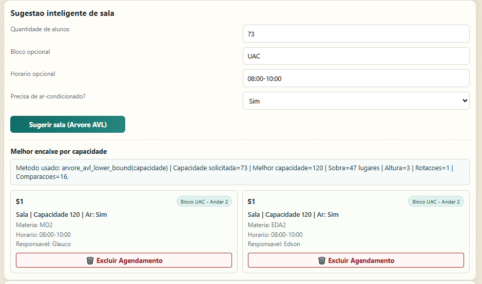

**2. Interface: Conflito de Horário Detectado (Árvore Vermelho-Preta)**
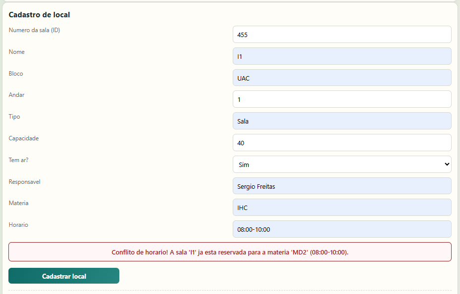

**3. Interface: Cadastro sem Conflito (Árvore Vermelho-Preta)**
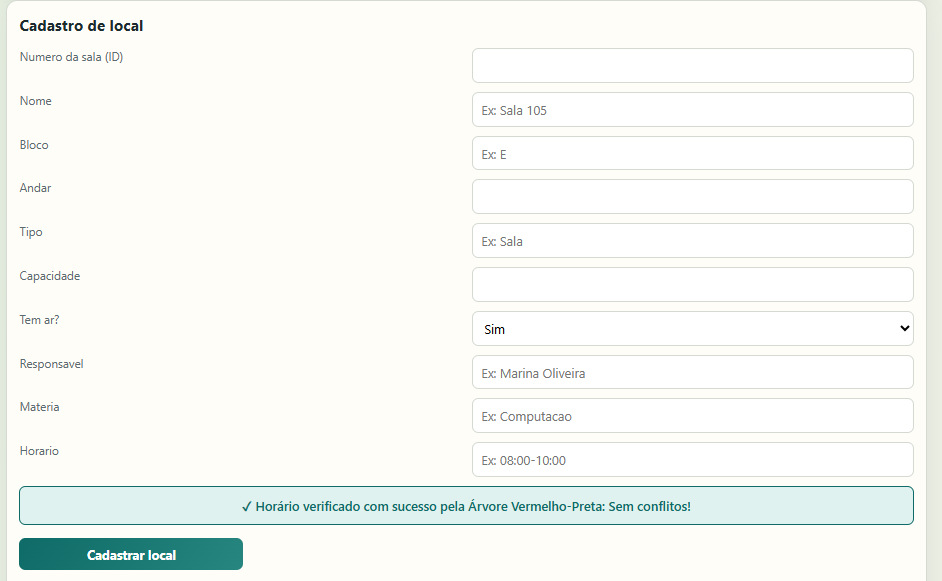

**4. Interface: Campo para Excluir Agendamento**
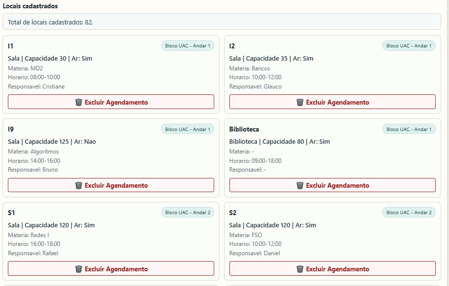

**5. Estrutura do Código: Nó AVL e Inicialização do Resultado**
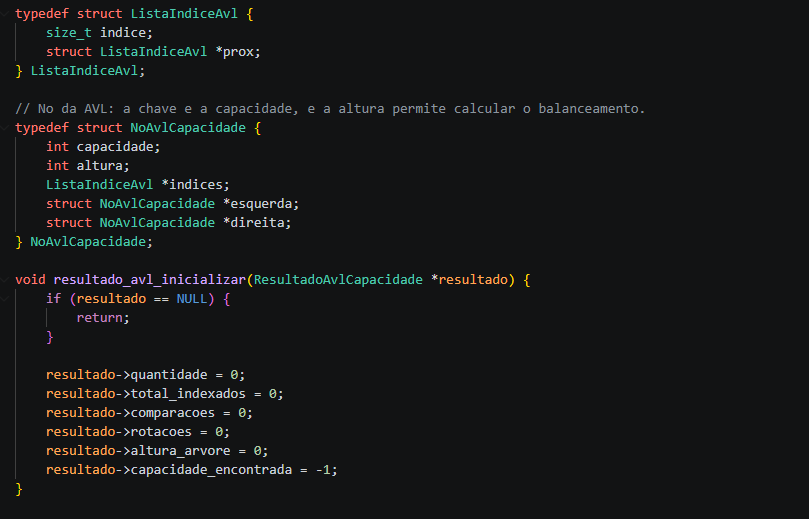

**6. Estrutura do Código: Filtro da Busca Inteligente AVL**
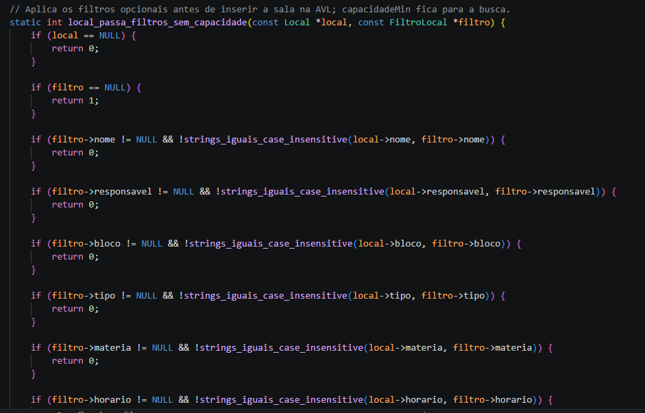

**7. Estrutura do Código: Rotação Direita da AVL**
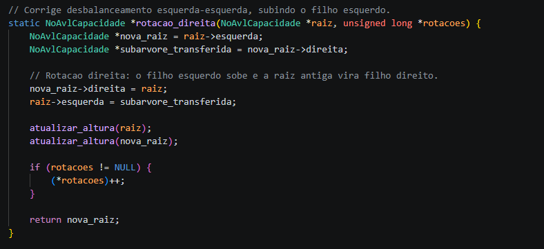

**8. Estrutura do Código: Inicialização da Árvore Vermelho-Preta**
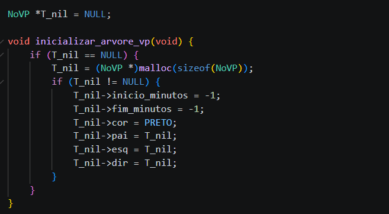

**9. Estrutura do Código: Conserta Inserção VP**
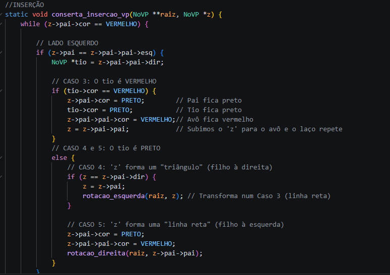

**10. Estrutura do Código: Inserção na Árvore VP**
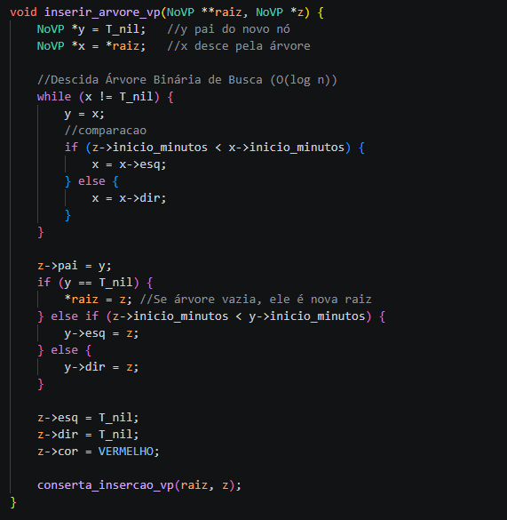

**11. Estrutura do Código: Conserta Remoção VP (Duplo Preto)**
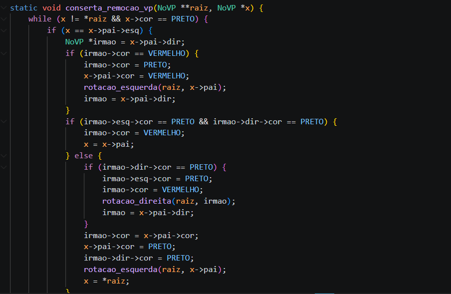

**12. Servidores em Execução (Estabilidade)**
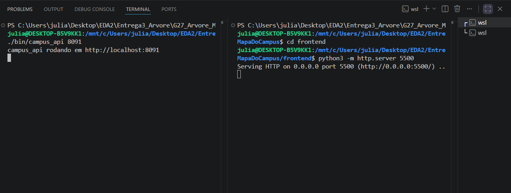

## Instalação 
Linguagem: C (Backend) e HTML/JS/CSS (Frontend)<br>
Framework: Nenhum (Sockets nativos em C)<br>

**Pré-requisitos:**
* Compilador `gcc` (C11)
* `make`
* `python3` (necessário apenas para subir o servidor local do frontend)

## Uso 
Para rodar a aplicação completa, você precisará iniciar o backend e o frontend em **dois terminais diferentes**.

**Terminal 1 (Iniciando o Backend em C):**
```bash
make run-api
```

**Terminal 2 (Iniciando o Frontend):**
```bash
cd frontend
python3 -m http.server 5500
```

Após rodar os dois comandos, abra o seu navegador e acesse: `http://localhost:5500`.

**Documentação da API Disponível:**
* `GET /api/busca`: Busca com filtros (ex: `id`, `nome`, `bloco`, `andar`, `tipo`, `responsavel`, `materia`, `horario`, `temAr`, `capacidadeMin`). O sistema decide automaticamente qual algoritmo utilizar com base no parâmetro fornecido.
  * Ordenação opcional: `ordenarPor=id|nome|capacidade|relevancia`, `algoritmoOrdenacao=quicksort|mergesort|heapsort|insertionsort`, `ordem=asc|desc`.
* `GET /api/locais`: Lista todos os locais cadastrados (também aceita os parâmetros de ordenação opcionais).
* `POST /api/locais`: Cadastro de novo local (form urlencoded). Antes de inserir, o backend constrói uma **Árvore Vermelho-Preta** com os agendamentos existentes da sala e valida se há conflito de horário.
* `DELETE /api/locais/:id`: Exclusão de agendamento. O motor da **Árvore Vermelho-Preta** executa as rotações de Duplo Preto se necessário e atualiza o CSV.
* `GET /api/ranking/capacidade`: Ranking de maiores salas por capacidade usando **Heap Sort**.
  * Parâmetro opcional: `top` (ex: `GET /api/ranking/capacidade?top=10`).
* `GET /api/sugestao/avl`: Sugestão de sala por capacidade usando **Árvore AVL**.
  * Parâmetro obrigatório: `capacidadeMin` (ex: `GET /api/sugestao/avl?capacidadeMin=73`).
  * Parâmetros opcionais: `bloco`, `horario`, `temAr`, `andar`, `tipo`, `responsavel`, `materia`.
  * A resposta inclui métricas: `comparacoes`, `rotacoes`, `alturaArvore`, `totalIndexados` e `capacidadeEncontrada`.

*Exemplo de requisição de busca nativa via terminal (cURL):*
```bash
curl "http://localhost:8091/api/busca?bloco=UAC&capacidadeMin=40"
```

## Outros 
**Estrutura de Pastas do Projeto:**
* `backend/include`: Contratos compartilhados (structs e assinaturas).
* `backend/src`: Implementações em C (métodos de busca clássicos, Busca Hash, algoritmos de ordenação e API).
* `backend/data`: Banco local em CSV populado com as salas.
* `frontend`: Interface de pesquisa, filtros, cadastro e ranking conectada à API.
* `docs`: Setup e organização da equipe (veja o guia completo em [docs/SETUP.md](docs/SETUP.md)).

**Destaques da Arquitetura:**
* **Modularidade:** As lógicas da AVL e da Árvore Vermelho-Preta foram isoladas em módulos próprios (`arvore_avl.c` e `arvore_vp.c`), separados da infraestrutura HTTP.
* **Roteamento de Ordenação:** Insertion Sort para inserção pontual, Quick Sort para buscas gerais, Merge Sort para ordenações estáveis e Heap Sort para rankings.
* **Roteamento de Busca:** O sistema seleciona automaticamente entre Tabela Hash, Busca Binária, Busca por Interpolação e Busca Sequencial Indexada conforme o parâmetro recebido.
* **Case-Insensitive Search na Hash:** Varredura caractere por caractere com conversão para *lowercase* em tempo de execução, permitindo encontrar locais independentemente da formatação textual da query.

## Apresentação em Vídeo
**Vídeo de Apresentação e Explicação do Código:**

[](https://www.youtube.com/watch?v=RTrcx9Xhhbk)
