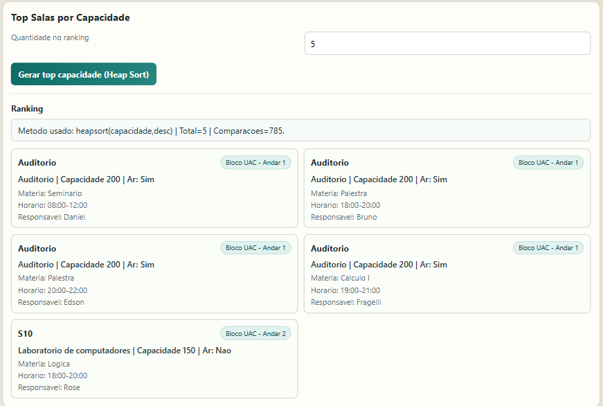
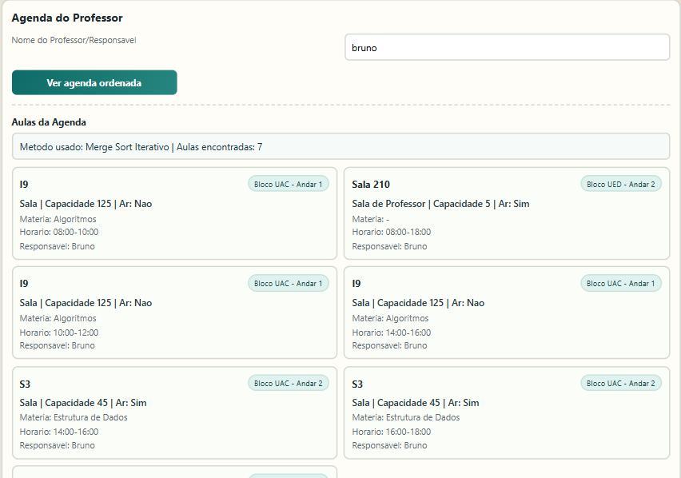
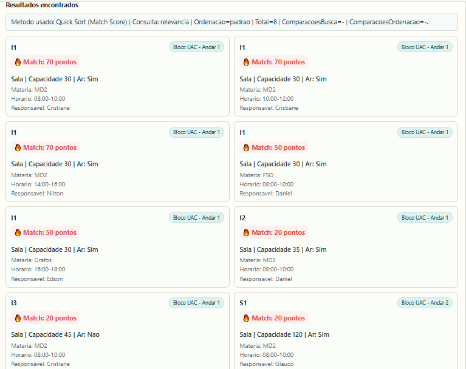
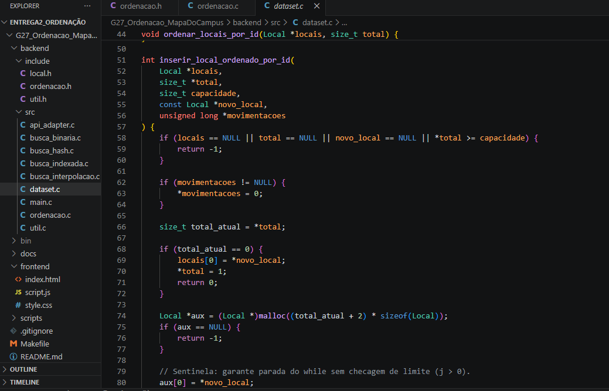
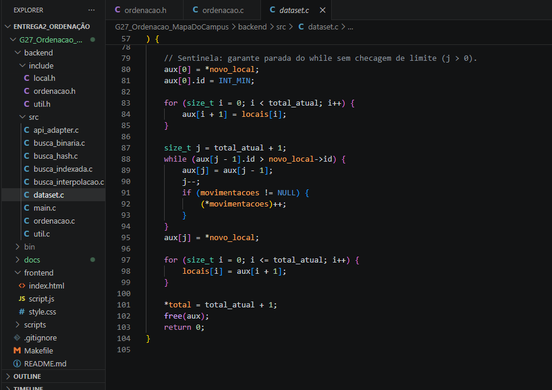
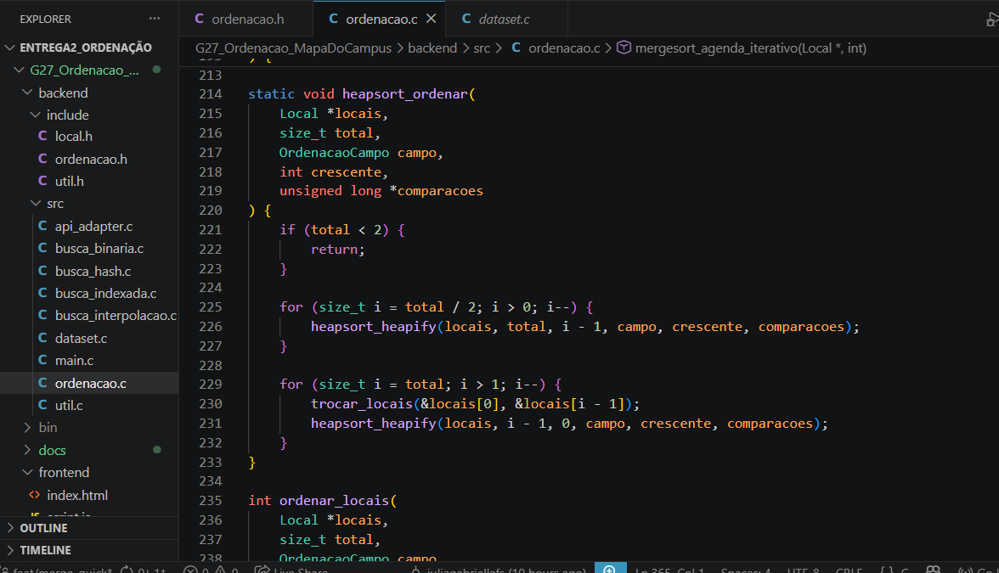
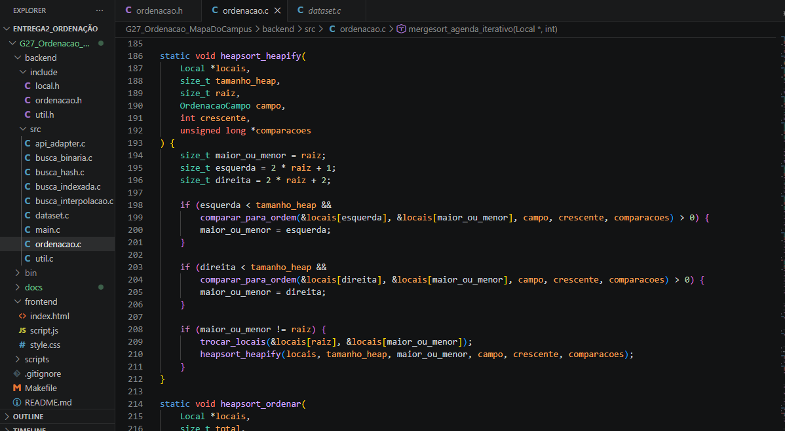
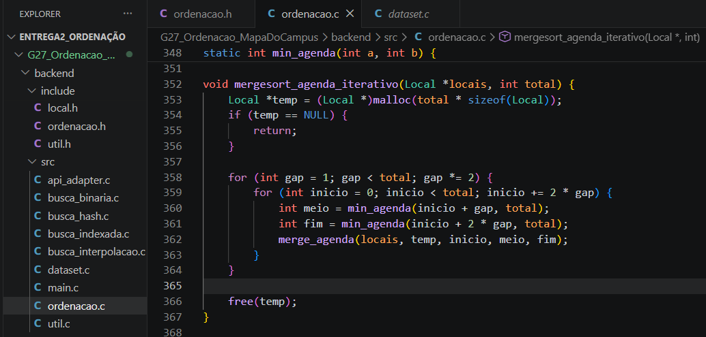
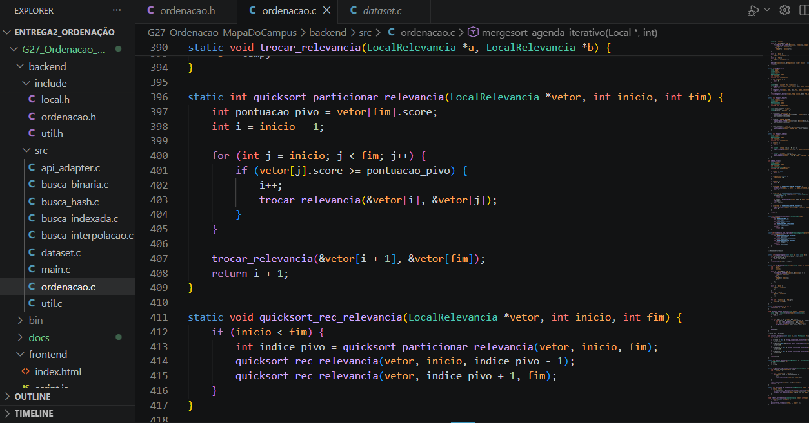
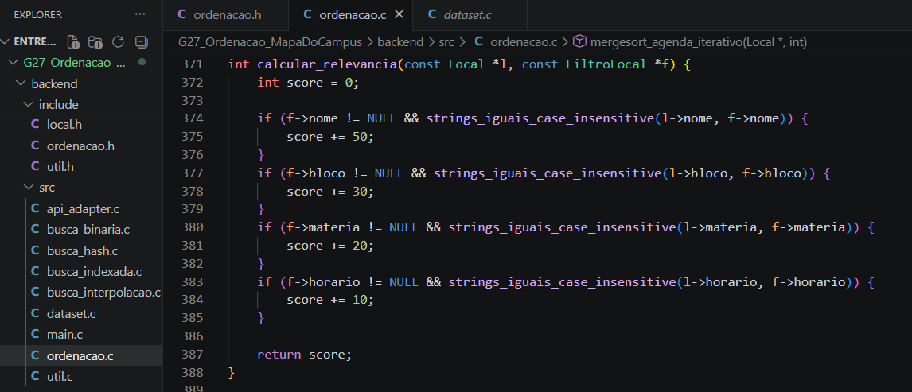

# Mapa de Campus

Número da Lista: Trabalho 2 - Ordenação <br>
Conteúdo da Disciplina: Algoritmos de Ordenação <br>

## Alunas
|Matrícula | Aluno |
| -- | -- |
| 231035722  | Marina Agostini Galdi |
| 241036142  | Júlia Gabriella Ferreira Siqueira |

## Sobre 
O **Mapa de Campus** é um serviço projetado para gerenciar e consultar o catálogo de locais de um campus universitário (salas, laboratórios, auditórios, etc.). O principal objetivo deste projeto é aplicar estruturas de dados de alto desempenho na prática, conectando um backend nativo em C a uma interface Web de pesquisas e filtros.

O sistema atua como uma central inteligente de roteamento de buscas:
* **Buscas Numéricas e Textuais secundárias (ID, Capacidade, Andar, etc.):** Utilizam a combinação de Busca Binária, Busca Sequencial Indexada e Busca por Interpolação, isolando blocos de memória para reduzir as varreduras.
* **Busca Textual Primária (Nome do local):** É interceptada por uma **Tabela de Espalhamento (Hash)**. Utilizando a matemática do Método da Divisão para o cálculo de índices e Listas Encadeadas para o tratamento de colisões (Hashing Estático Aberto), o sistema garante tempo de recuperação constante O(1) e acesso direto à memória.

O sistema também conta com um **roteador inteligente de ordenação**, selecionando automaticamente o algoritmo mais adequado para cada situação:
* **Insertion Sort:** Utilizado no cadastro de novos locais. Em vez de reordenar a lista inteira, o novo registro é encaixado diretamente na posição correta por `id`, usando lógica de sentinela para maior eficiência.
* **Quick Sort:** Algoritmo padrão para ordenação dos resultados de busca na tela. Ideal para listas maiores quando o usuário ordena por `capacidade`, `id` ou `relevância`.
* **Merge Sort:** Utilizado para ordenações estáveis por `nome` ou `horário`. Garante que registros com valores iguais mantenham a ordem original, sendo ideal para a agenda de um responsável.
* **Heap Sort:** Alternativa de desempenho garantido O(n log n) para listas grandes. Usado como modo "robusto" no backend e para gerar o ranking das salas de maior capacidade.

## Casos de Uso dos Algoritmos de Ordenação

**1. Cadastro inteligente de local novo — Insertion Sort**
> Ao cadastrar uma nova sala, ela já entra na posição correta na lista ordenada por `id`, sem reordenar a lista inteira.
> **Tela:** Seção "Locais Cadastrados".

**2. Top salas para turma grande — Heap Sort**
> O botão "Top 10 maiores capacidades" gera um ranking das salas com maior lotação usando Heap Sort, com desempenho garantido mesmo para grandes volumes de dados.
> **Tela:** Aba "Ranking de Salas".

**3. Agenda de uso por professor — Merge Sort**
> Ao filtrar por "Responsável" e clicar em "Ver agenda ordenada", as aulas são listadas por horário com ordenação estável — em caso de empate, a ordem por nome/sala é preservada.
> **Tela:** Filtro "Responsável" + botão "Ver agenda ordenada".

**4. Resultados da busca por relevância — Quick Sort**
> Após uma busca com múltiplos filtros, os resultados são ordenados por "pontuação de relevância" (quanto mais campos coincidem — nome, bloco, horário — maior a pontuação). O Quick Sort é usado por ser o mais rápido na média para essa ordenação dinâmica.
> **Tela:** Resultados da pesquisa com opção "Ordenar por relevância".

## Screenshots

**1. Interface: Ranking de Maiores Salas com Heap Sort**


**2. Interface: Agenda por Responsável com Merge Sort**


**3. Interface: Ordenação por Relevância com Quick Sort**


**4. Estrutura do Código: Insertion Sort**


**5. Estrutura do Código: Insertion Sort com Sentinela**


**6. Estrutura do Código: Heap Sort**


**7. Estrutura do Código: Heapify**


**8. Estrutura do Código: Merge Sort**


**9. Estrutura do Código: Quick Sort**


**10. Estrutura do Código: Ordenação por Relevância**


**11. Servidores em Execução (Estabilidade)**


## Instalação 
Linguagem: C (Backend) e HTML/JS/CSS (Frontend)<br>
Framework: Nenhum (Sockets nativos em C)<br>

**Pré-requisitos:**
* Compilador `gcc` (C11)
* `make`
* `python3` (necessário apenas para subir o servidor local do frontend)

## Uso 
Para rodar a aplicação completa, você precisará iniciar o backend e o frontend em **dois terminais diferentes**.

**Terminal 1 (Iniciando o Backend em C):**
```bash
make run-api
```

**Terminal 2 (Iniciando o Frontend):**
```bash
cd frontend
python3 -m http.server 5500
```

Após rodar os dois comandos, abra o seu navegador e acesse: `http://localhost:5500`.

**Documentação da API Disponível:**
* `GET /api/busca`: Busca com filtros (ex: `id`, `nome`, `bloco`, `andar`, `tipo`, `responsavel`, `materia`, `horario`, `temAr`, `capacidadeMin`). O sistema decide automaticamente qual algoritmo (Binária, Interpolada, Indexada ou Hash) utilizar com base no parâmetro fornecido.
  * Ordenação opcional dos resultados: `ordenarPor=id|nome|capacidade|relevancia`, `algoritmoOrdenacao=quicksort|mergesort|heapsort|insertionsort`, `ordem=asc|desc`.
* `GET /api/locais`: Lista todos os locais cadastrados (também aceita os parâmetros de ordenação opcionais).
* `POST /api/locais`: Cadastro de novo local (form urlencoded) com os campos obrigatórios: `id`, `nome`, `bloco`, `andar`, `tipo`, `capacidade`, `temAr`, `responsavel`, `materia`, `horario`.
  * Inserção inteligente por `id` usando lógica de **Insertion Sort com sentinela** (insere na posição correta sem reordenar a lista inteira).
* `GET /api/ranking/capacidade`: Ranking de maiores salas por capacidade usando **Heap Sort**.
  * Parâmetro opcional: `top` (ex: `GET /api/ranking/capacidade?top=10`).

*Exemplo de requisição de busca nativa via terminal (cURL):*
```bash
curl "http://localhost:8091/api/busca?bloco=UAC&capacidadeMin=40"
```

## Outros 
**Estrutura de Pastas do Projeto:**
* `backend/include`: Contratos compartilhados (structs e assinaturas).
* `backend/src`: Implementações em C (métodos de busca clássicos, Busca Hash, algoritmos de ordenação e API).
* `backend/data`: Banco local em CSV populado com as salas.
* `frontend`: Interface de pesquisa, filtros, cadastro e ranking conectada à API.
* `docs`: Setup e organização da equipe (veja o guia completo em [docs/SETUP.md](docs/SETUP.md)).

**Destaques da Arquitetura:**
* **Modularidade:** O código-fonte foi estruturado separando a lógica matemática dos algoritmos de busca e ordenação da infraestrutura de rede HTTP (endpoints).
* **Roteamento de Ordenação:** O sistema seleciona automaticamente o algoritmo mais adequado conforme o contexto — Insertion Sort para inserção pontual, Quick Sort para buscas gerais, Merge Sort para ordenações estáveis e Heap Sort para rankings e volumes grandes.
* **Case-Insensitive Search na Hash:** A implementação da Tabela Hash conta com otimização de varredura caractere por caractere (conversão para *lowercase* em tempo de execução), permitindo encontrar locais independentemente da formatação textual da query, protegendo a integridade dos dados no banco.


## Apresentação em Vídeo
**Vídeo de Apresentação e Explicação do Código:**

[](https://www.youtube.com/watch?v=iwlPHIlbZy8)
